<p align="center"></p>
<h1 align="center">REWIRE</h1>
<p align="center"><b>Break habits. Build control.</b></p>

<p align="center">
  
  
  
  
  
  
</p>

REWIRE is an Android app that reduces unwanted habits by adding **intentional friction** before distracting apps open. It is not a punishment or surveillance tool. It creates a pause, lets you choose, and measures what happens so you can learn your own patterns.

```
Friction → Awareness → Choice → Action → Measurement → Improvement
```

<p align="center"><a href="rewire-launch.mp4"></a></p>
<p align="center"><sub>Launch video (click for the full-quality MP4)</sub></p>

## Screenshots

| Guard | Habit detail | Max block screen |
|:---:|:---:|:---:|
| 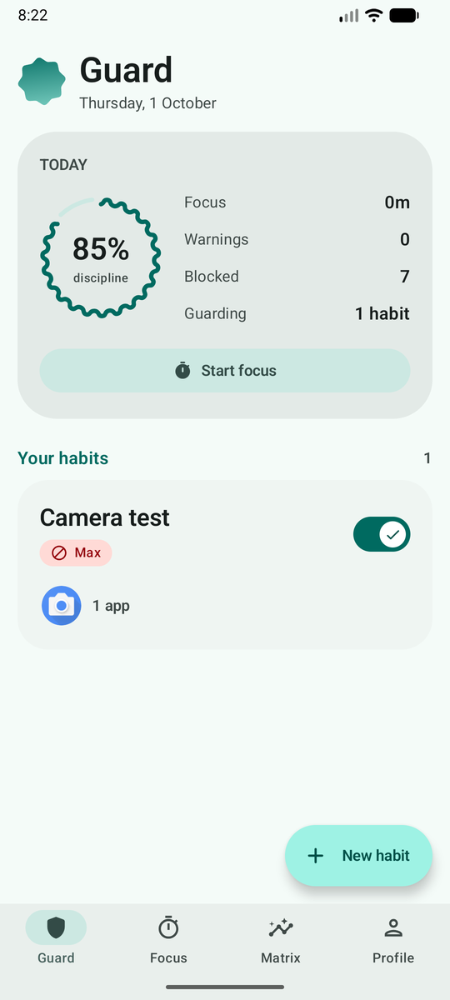 | 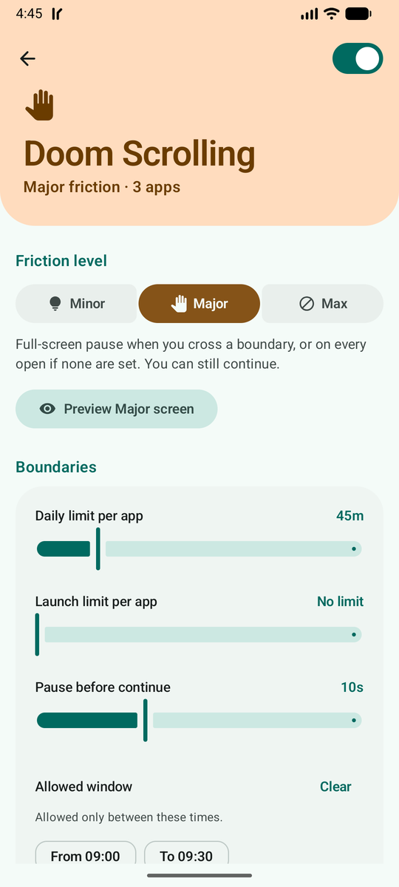 | 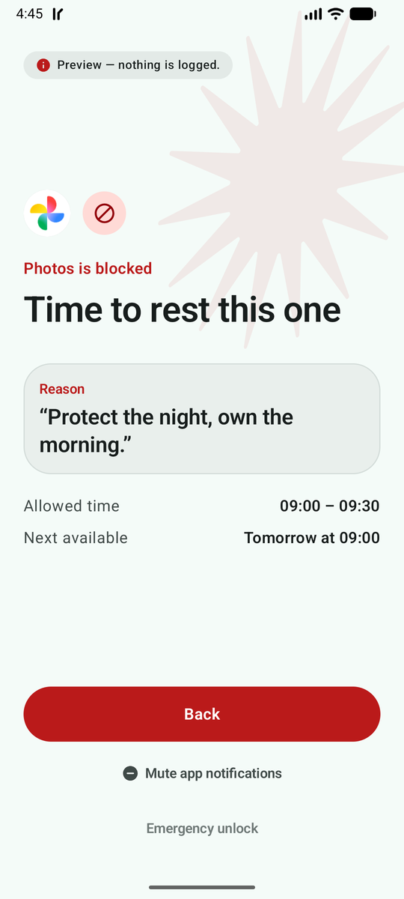 |
| Today dashboard and your habits | Friction level, limits, allowed window | Hard boundary with your own reason and an emergency unlock |

| Focus | Matrix | Matrix (more) |
|:---:|:---:|:---:|
| 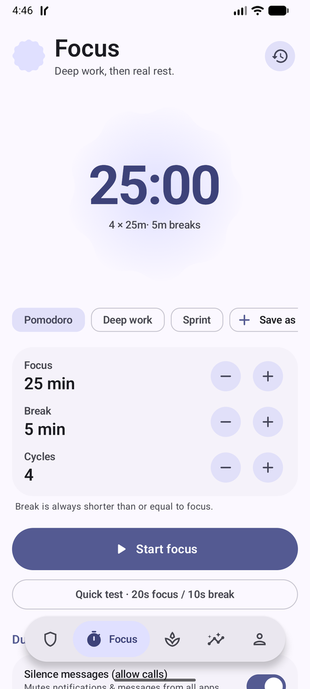 | 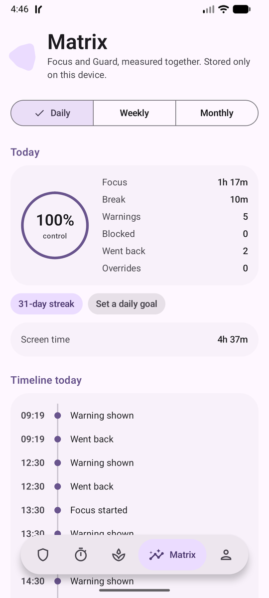 | 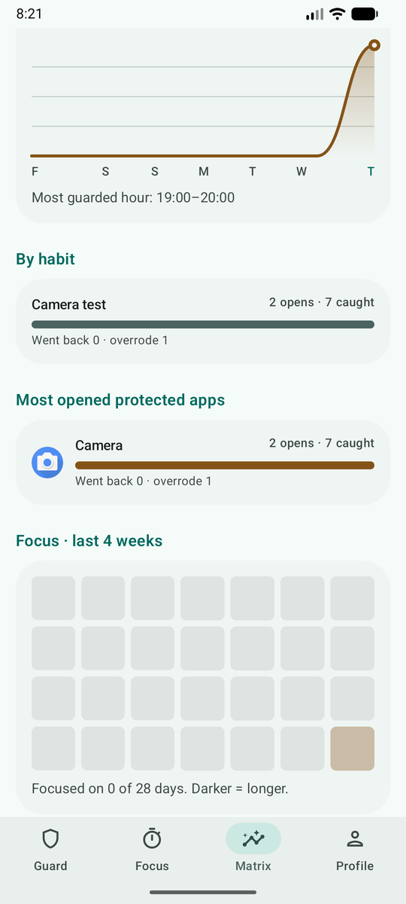 |
| Focus / break / cycles timer | Today's focus and Guard stats with a timeline | Monthly profile, trends and focus calendar |

| Warning library | Profile | Permissions |
|:---:|:---:|:---:|
| 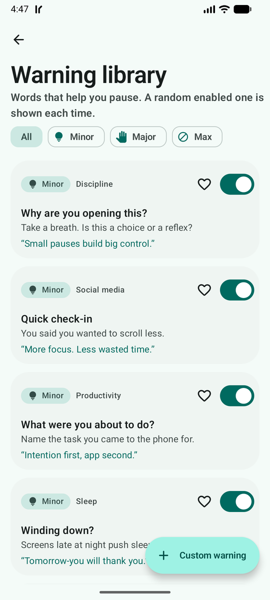 | 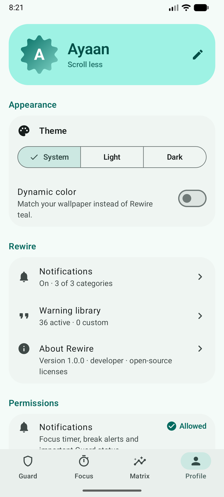 | 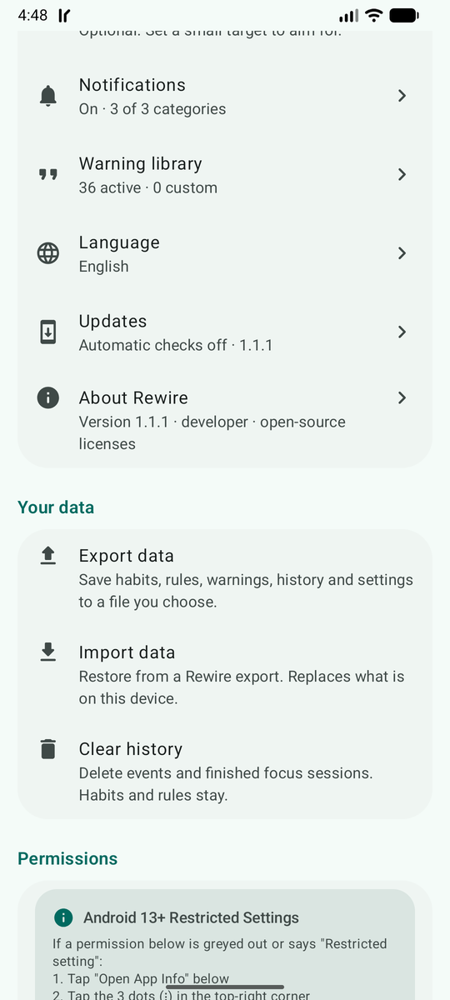 |
| Data-driven, editable warnings | Theme, dynamic color, settings | Every permission explained |

### Tablet, foldable and large screens

REWIRE adapts to the window: a navigation rail and list-detail panes on tablets and unfolded foldables, two-column Matrix charts, and the usual bottom bar on phones.

| Tablet (landscape) | Tablet (landscape) |
|:---:|:---:|
| 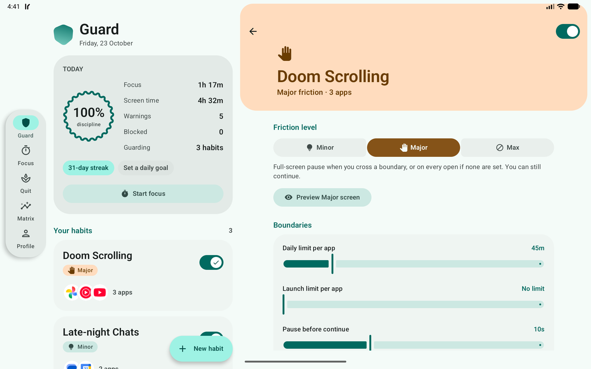 | 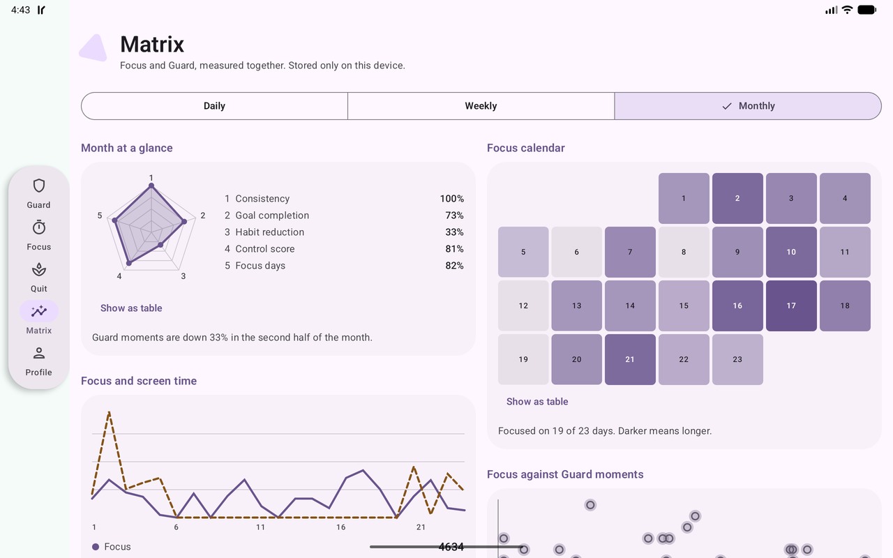 |
| Guard list with the habit detail beside it | Matrix monthly profile and focus calendar |

| Foldable (unfolded) | Foldable (unfolded) | Tablet (portrait) | Tablet (portrait) |
|:---:|:---:|:---:|:---:|
| 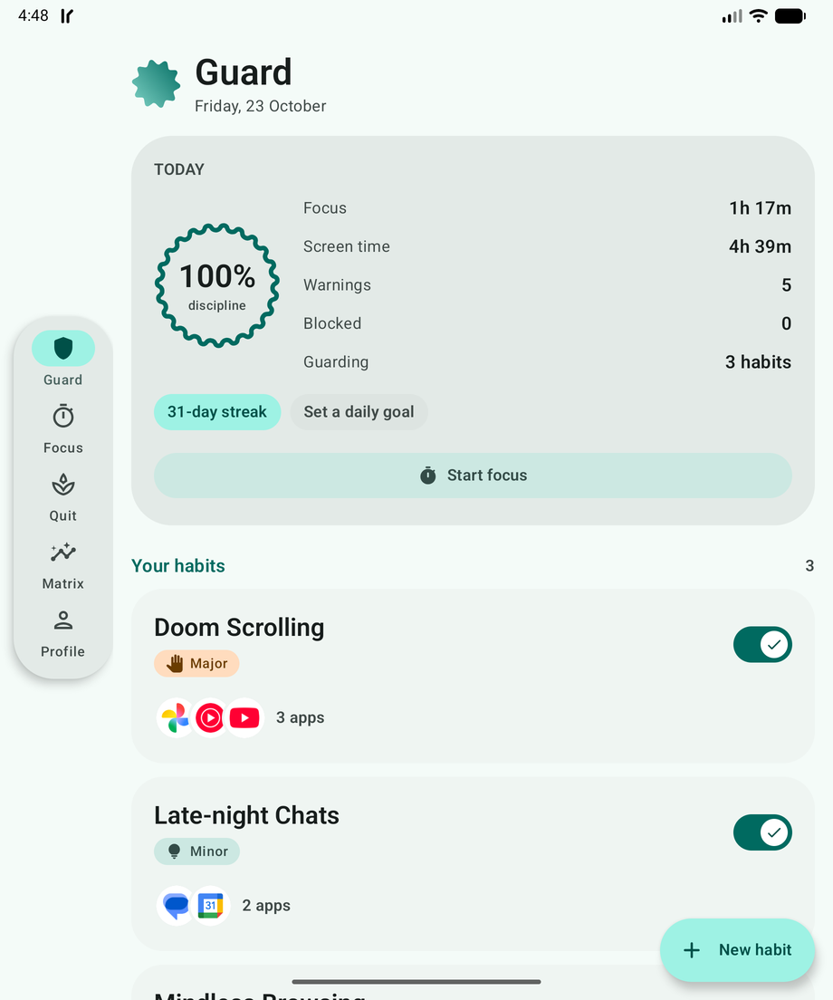 | 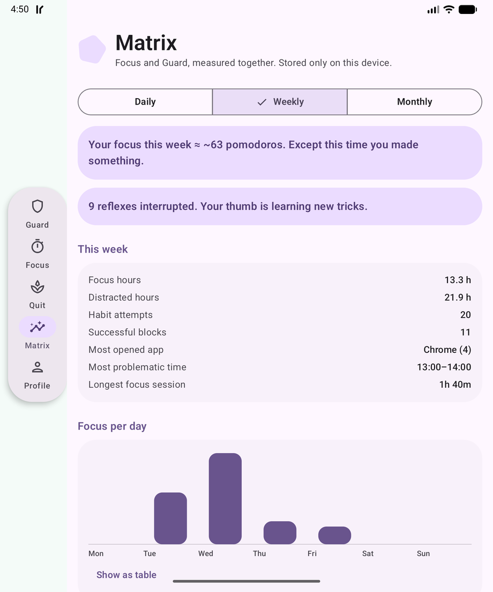 | 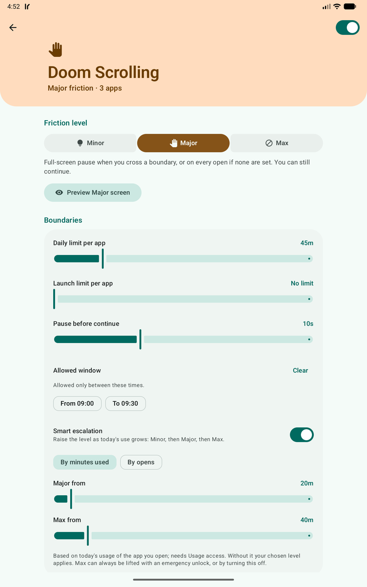 | 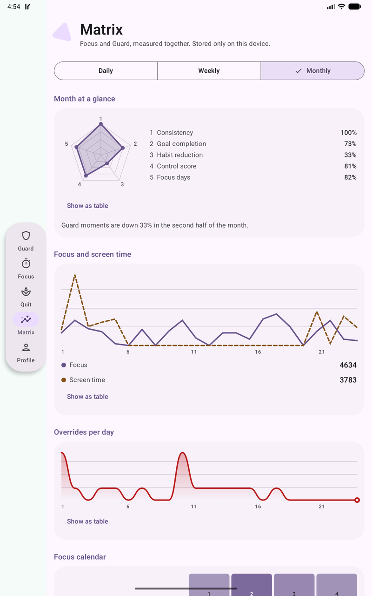 |
| Guard with the rail | Matrix weekly | Habit detail | Matrix monthly |

### Dynamic color and languages

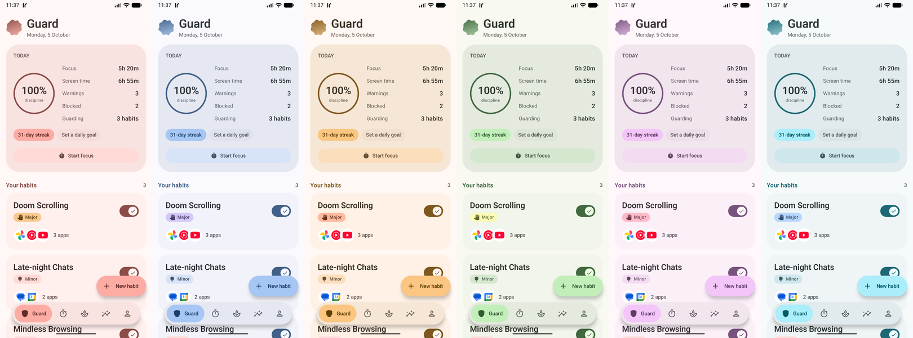

<sub>Dynamic color follows your wallpaper: the same screen in six palettes.</sub>

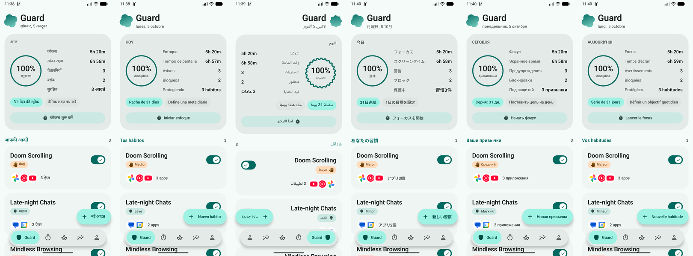

<sub>Hindi, Spanish, Arabic (right-to-left), Japanese, Russian and French. 27 languages in total.</sub>

Every chart also has a **Show as table** view:

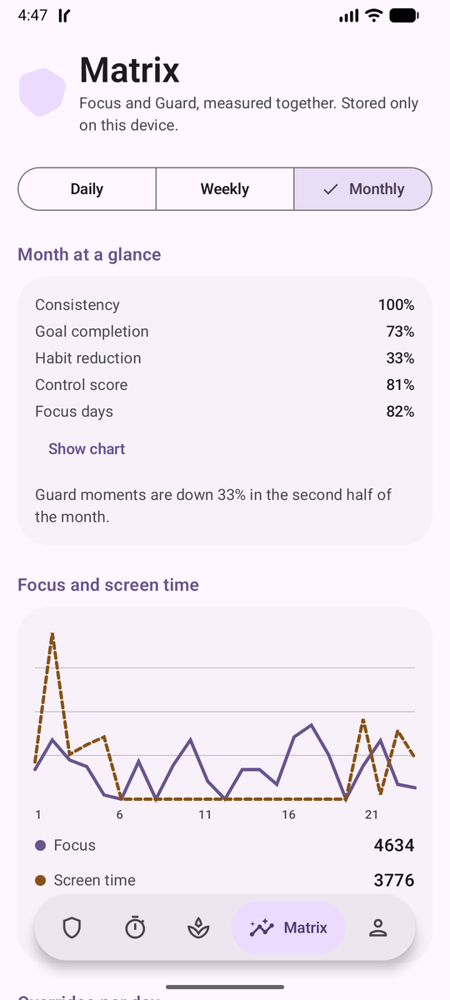

## Features

### Guard: protected apps and habit rules
- **Habits are first-class.** One habit (e.g. *Doom Scrolling*) groups many apps (Instagram, Reddit, YouTube).
- **Three friction levels**
  | Level | Behavior |
  |---|---|
  | **Minor** | A short "why are you opening this?" pause. Never blocks. Logged. |
  | **Major** | Warning with *Go back* or *Continue anyway*. Every warning and override is logged. |
  | **Max** | Hard block outside your boundary, with a deliberate emergency unlock (device PIN, pattern or biometric) that is logged. |
- **Boundaries per habit:** daily time limit, launch limit, allowed time window. An app can override them with its own limits.
- **Smart escalation (optional, off by default):** configurable Minor, Major and Max tiers by minutes used today, or by how many times you opened the app.
- **Safe by design:** rules can be disabled any time, Max never causes a device lockout, and Max bypass is off during Focus by default.

### Focus: concentration sessions
- Configurable focus, break and cycle counts. Built-in presets: Pomodoro (25/5 × 4), Deep work (50/10 × 4), Sprint (20/5 × 3), plus your own saved presets.
- Validated rule: `breakDuration <= focusDuration`.
- State machine: `IDLE → FOCUSING → BREAK → PAUSED → COMPLETED / CANCELLED`.
- Runs as a foreground service that survives the app being closed and resumes from Room after a process kill. Optional Do Not Disturb that still lets calls and alarms through.
- Hold-to-end so escaping is not too easy. Focus can bypass selected Guard levels (Minor on, Major configurable, Max off by default).
- Full-screen timer with landscape layout, session notes and history.

### Quit: private habit counters
- Multiple independent counters with live progress (days, hours, minutes), best streak preserved, and milestone ring (1, 3, 7, 14, 21, 30, 60, 90, 180, 365 days, then yearly).
- Calm slip recovery: "I slipped" flow records the moment, keeps your best run saved, and displays restarts in the last 30 days without shame.
- "Ride the wave" urge surfing: 2-minute paced breathing (4-4-6 rhythm) with a grounding thought per breath, followed by actionable ideas.
- Thought of the day and browseable reflections from a 1,006-thought collection localized across all 27 languages.
- Private by design: kept in its own dedicated DataStore, strictly isolated from Room, analytics events, Matrix, and exports.

### Matrix: analytics
- Daily, weekly and monthly views built from the event log and Usage access screen time.
- Nine chart types: line, area, bar, stacked bar, donut, radar, calendar heatmap, timeline and scatter. Each has an accessible table alternative.
- Guard breakdown (went back, continued, blocked, overrides), most guarded hour, by-habit and most-opened-app lists.
- Daily goals (focus target, max overrides) with streaks. A short, light-hearted summary line on top.
- Charts consume normalized domain metrics and never query Android APIs directly.

### Profile
- Theme (system, light, dark), dynamic color and **language**.
- Warning library: add, edit, delete, favorite, enable/disable, randomized selection.
- Notification categories, goals, permission status and guidance, about and acknowledgements.
- Your data: export, import, clear history (versioned JSON, validated, one transaction).
- Updates: opt-in check against GitHub Releases with Stable, Beta and Alpha channels (not in the Play build).

### Privacy
Everything stays on the device. No analytics SDKs, no accounts, no cloud sync. Accessibility is used only for window-change events (the foreground package name), never for screen content. The only network call is the optional update check, which reads the public release list and sends nothing about you or your usage. The Play build has no network permission at all.

## Languages

REWIRE is available in **27 languages**. Pick one in **Profile → Language**, or, on Android 13+, in Android's own per-app language settings. The default follows your phone.

| | | | |
|---|---|---|---|
| English | हिन्दी (Hindi) | Español | Português (Brasil) |
| Bahasa Indonesia | العربية (Arabic, RTL) | Français | Русский |
| Deutsch | Türkçe | 日本語 | 한국어 |
| Italiano | Tiếng Việt | ไทย | 简体中文 |
| 繁體中文 | Polski | বাংলা | தமிழ் (Tamil) |
| తెలుగు (Telugu) | मराठी (Marathi) | ગુજરાતી (Gujarati) | ಕನ್ನಡ (Kannada) |
| മലയാളം (Malayalam) | ਪੰਜਾਬੀ (Punjabi) | اردو (Urdu, RTL) | |

Everything is translated: the UI, plurals, notification channels, the Matrix summary lines and the built-in warning library. A built-in warning you have not edited follows the app language, and one you reworded stays exactly as you wrote it. The translations are machine-generated and have not had a native-speaker review yet, so corrections are welcome. How to add a language: [`development/docs/LOCALIZATION.md`](development/docs/LOCALIZATION.md).

## Architecture

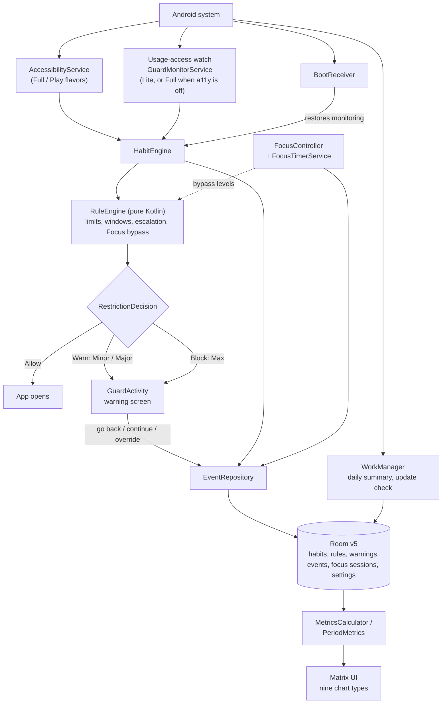
```mermaid
flowchart TD
    OS["Android system"]
    A11y["AccessibilityService<br/>(Full / Play flavors)"]
    Usage["Usage-access watch<br/>GuardMonitorService<br/>(Lite, or Full when a11y is off)"]
    Boot["BootReceiver"]
    Work["WorkManager<br/>daily summary, update check"]

    OS --> A11y
    OS --> Usage
    OS --> Boot
    OS --> Work

    A11y --> Engine["HabitEngine"]
    Usage --> Engine
    Boot -->|restores monitoring| Engine
    Engine --> Rules["RuleEngine (pure Kotlin)<br/>limits, windows, escalation, Focus bypass"]
    Rules --> Decision{"RestrictionDecision"}
    Decision -->|Allow| Open["App opens"]
    Decision -->|Warn: Minor / Major| GuardUI["GuardActivity<br/>warning screen"]
    Decision -->|Block: Max| GuardUI
    GuardUI -->|go back / continue / override| Events["EventRepository"]
    Engine --> Events

    Focus["FocusController<br/>+ FocusTimerService"] --> Events
    Focus -.->|bypass levels| Rules

    Events --> Room[("Room v5<br/>habits, rules, warnings,<br/>events, focus sessions, settings")]
    Work --> Room
    Room --> Metrics["MetricsCalculator /<br/>PeriodMetrics"]
    Metrics --> Matrix["Matrix UI<br/>nine chart types"]
```

**Layering:** `Composable → ViewModel → Repository → Room / DataStore`. The `domain` package has no Android imports, so rule, focus, analytics and update logic is tested on the plain JVM. Hilt wires everything from a single `AppModule`.

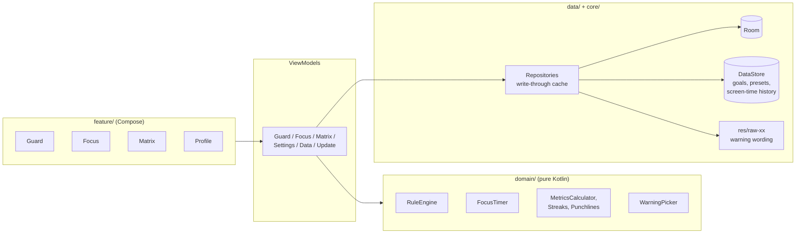
```mermaid
flowchart LR
    subgraph UI["feature/ (Compose)"]
        Guard
        FocusUI["Focus"]
        MatrixUI["Matrix"]
        Profile
    end
    subgraph VM["ViewModels"]
        VMs["Guard / Focus / Matrix /<br/>Settings / Data / Update"]
    end
    subgraph Domain["domain/ (pure Kotlin)"]
        RuleEngine
        FocusTimer
        Analytics["MetricsCalculator,<br/>Streaks, Punchlines"]
        Warn["WarningPicker"]
    end
    subgraph Data["data/ + core/"]
        Repos["Repositories<br/>write-through cache"]
        Room[("Room")]
        DS[("DataStore<br/>goals, presets,<br/>screen-time history")]
        Res["res/raw-xx<br/>warning wording"]
    end

    UI --> VMs --> Repos
    VMs --> Domain
    Repos --> Room
    Repos --> DS
    Repos --> Res
```

**Key rules**
- Restriction decisions live in one place, `RuleEngine`. The accessibility service only detects the foreground app and forwards it.
- Warning text is data (`res/raw*/default_warnings.json`, plus user-edited warnings), and every UI string is in `strings.xml`, so nothing is hardcoded in the UI.
- Everything important becomes a `HabitEvent` (`APP_OPENED`, `WARNING_SHOWN`, `APP_BLOCKED`, `OVERRIDE_USED`, `FOCUS_*` and so on), and the events power Matrix.
- State is persisted in Room so a killed process recovers its rules and any running focus session. REWIRE does not assume Android keeps it alive.
- Three build flavors share one codebase: **Full** (Accessibility), **Lite** (Usage access, no accessibility service) and **Play** (Full without the self-updater). See [`FLAVORS.md`](development/docs/FLAVORS.md).

### Project structure

```
app/src/main/java/com/aiyu/rewire/
├── RewireApp.kt, MainActivity.kt    Application, entry point
├── di/                              Hilt AppModule (Room, repositories, settings, engines)
├── core/
│   ├── analytics/       Daily summary worker
│   ├── apps/            Installed launcher apps (PackageManager)
│   ├── focus/           FocusController (app-scoped timer, persists every transition)
│   ├── guard/           HabitEngine, UsageTracker, GuardShield
│   ├── notifications/   Channels, notifier, Do Not Disturb, permission helpers
│   ├── permissions/     Accessibility / usage / overlay / battery status checks
│   ├── settings/        Settings model and repository, AppLocale (per-app language)
│   └── update/          GitHub self-updater, worker, install receiver
├── data/                Repositories (write-through cache), backup, presets, goals, screen-time store
│   └── local/           RewireDatabase, entities, DAOs, mappers, legacy import
├── domain/              Pure Kotlin
│   ├── habit/           Habit, ProtectedApp, RestrictionRule, AppLimits
│   ├── restriction/     RuleEngine, RestrictionDecision
│   ├── warning/         Warning, categories, picker
│   ├── focus/           FocusConfig validation, FocusTimer state machine, presets
│   ├── goals/           Goals, streaks
│   ├── analytics/       HabitEvent, metrics, period metrics, punchlines
│   ├── backup/          Versioned export / import format
│   └── update/          Versions, release channels, release notes
├── feature/             landing, onboarding, guard, focus, matrix, profile, update
├── service/
│   ├── accessibility/   RewireAccessibilityService (Full and Play only)
│   ├── monitoring/      GuardMonitorService (usage watch)
│   ├── focus/           FocusTimerService
│   └── boot/            BootReceiver
└── ui/                  theme (color, type, shape, motion), shared components, nav host
app/src/main/res/        values-xx/strings.xml and raw-xx/default_warnings.json per language
```

More detail: [`ARCHITECTURE.md`](development/docs/ARCHITECTURE.md), [`DESIGN.md`](development/docs/DESIGN.md), [`DECISIONS.md`](development/docs/DECISIONS.md), [`ROADMAP.md`](development/docs/ROADMAP.md), [`LOCALIZATION.md`](development/docs/LOCALIZATION.md), [`UPDATES.md`](development/docs/UPDATES.md). Progress is tracked in [`development/Todo.md`](development/Todo.md).

## Tech stack

| Area | Choice |
|---|---|
| Language | Kotlin 2.4 |
| UI | Jetpack Compose, Material 3 Expressive (`1.5.0-alpha`), dynamic color |
| Navigation | Navigation Compose, type-safe routes, shared element transitions |
| DI | Hilt |
| Async | Coroutines + Flow |
| Persistence | Room (schema v5, exported, migration-tested) and DataStore Preferences |
| Background | WorkManager, foreground services, BootReceiver |
| Serialization | kotlinx.serialization |
| Monitoring | AccessibilityService, UsageStatsManager |
| Localization | 27 languages, Android per-app language API (`LocaleManager`, API 33+) with a fallback below |
| Other | Biometric, Core SplashScreen, Graphics Shapes (morphing shapes) |
| Testing | JUnit (JVM unit tests for domain logic), AndroidX Test (migrations) |

SDK: `minSdk 26`, `targetSdk 35`. Versions are in [`gradle/libs.versions.toml`](gradle/libs.versions.toml).

## Permissions

Each permission is explained in-app before it is requested.

| Permission | Why |
|---|---|
| Accessibility service (Full, Play) | Detect which protected app just opened. Reads no screen content. |
| Usage access | Count time in guarded apps for limits and Matrix, and detect launches in Lite. Stays on device. |
| Display over other apps | Show the warning or block screen on top of a guarded app (needed by Lite). |
| Notifications | Focus timer, break alerts, daily summary and important Guard status. |
| Do Not Disturb access (optional) | Silence messages during Focus while calls and alarms still ring. |
| Battery optimization (guidance only) | Reduce the chance the system stops protection. The app never changes this silently. |
| Internet, install packages (not in Play) | Optional self-update from GitHub Releases. |

> Android controls process lifetime. REWIRE is built for resilience (persisted state, system-bound services), not for a promise that it can never be killed.

## Install

Every [release](https://github.com/aiyu-ayaan/Rewire/releases) ships two APKs with the same features:

| APK | Detects protected apps through | Pick it when |
| --- | --- | --- |
| `Rewire-Lite-<version>.apk` | Usage access + Display over apps (within ~1 s) | You download from a browser. Play Protect lets it install, and banking/UPI apps keep working. |
| `Rewire-<version>.apk` (Full) | Accessibility (instant) | You install with [Obtainium](https://github.com/ImranR98/Obtainium) or `adb install`. |

Why two: Play Protect's fraud protection blocks browser and file-manager installs of any app that declares an accessibility service. Payment apps also refuse to run while one from outside Play is switched on. On Full, turn Rewire off in Accessibility before paying. Guard keeps working through Usage access (grant it and Display over apps), then turn it back on.

Both are signed with the same key. Install the other APK over the top to switch builds, and your data is kept. Each one updates itself within its own flavor.
**Profile → About Rewire** shows which one you have (*Full build* / *Lite build*).

Both keep guarding with Rewire closed or swiped away from recents. The Guard service runs on its own with an ongoing notification and restarts after the system kills it or the phone reboots. Two things stop it until you open Rewire again: **Force stop** in App info, and an aggressive battery saver. Set Rewire's battery usage to **Unrestricted**.

## Build and run

Requirements: Android Studio (current stable) or JDK 17+ with the Android SDK, and a device or emulator on API 26+.

```bash
# Build, install and launch the debug build on a connected device/emulator
./run.sh            # add --logs to stream logcat

# Or manually (Full; installLiteDebug for Lite, REWIRE_FLAVOR=Lite ./run.sh)
./gradlew installFullDebug

# Unit tests
./gradlew test
```

The debug build installs as `com.aiyu.rewire.debug`. After install, open **Profile → Permissions** to enable Accessibility (Full only), Usage access and the other grants, then create a habit in **Guard**.

## Testing

Domain logic is tested without Android: rule engine (Minor, Major, Max, daily and launch limits, allowed window, escalation, Focus bypass), focus state machine and `break <= focus` validation, warning picking and localisation rules, metrics and streak aggregation, backup format, release/version parsing. Room migrations have instrumented tests. See `app/src/test/` and `app/src/androidTest/`.

```bash
./gradlew :app:testFullDebugUnitTest :app:lintLiteDebug
```

## Roadmap

| Phase | Scope | Status |
|---|---|---|
| 1 | Expressive UI, 4-tab shell, notifications | done |
| 2 | Room persistence, Hilt | done |
| 3 | Guard engine, foreground-service focus timer, boot recovery, Full and Lite monitoring | done |
| 4–5 | Usage analytics, complete Matrix | done |
| 6 (V2) | Smart escalation, streaks, presets, goals, localisation (27 languages) | done, native review pending |
| 7 (V3) | Opt-in external data adapters, cloud backup, read-only AI insights | planned |

Rules always stay deterministic. Any future AI layer only explains recorded data and never controls restrictions.

## Contributing

Small, conventional commits (`feat:`, `fix:`, `refactor:`, `test:`). Keep business logic out of Activities, services and receivers, keep rule logic in `RuleEngine`, and add tests for rule-engine changes. See [`CLAUDE.md`](CLAUDE.md) for the full project rules.

## License

Released under the [MIT License](LICENSE).
