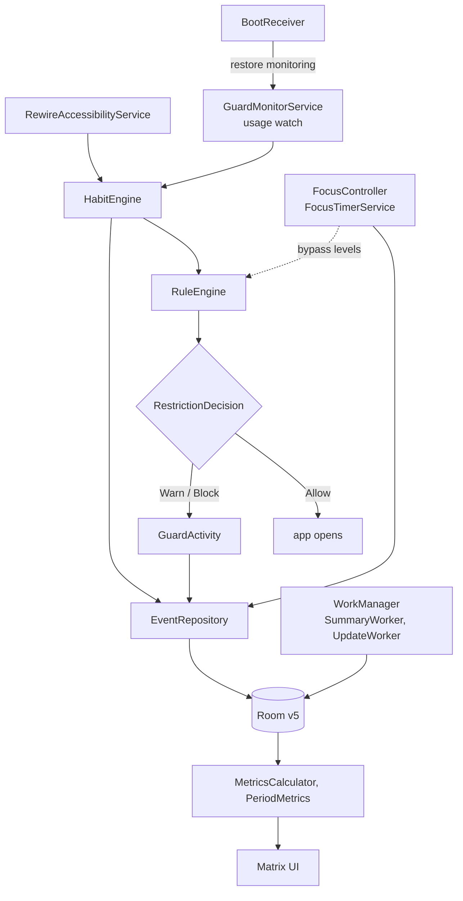

# Architecture

Current as of 2026-10-04 (Room schema v5, 27 languages). Rationale for choices lives in [DECISIONS.md](DECISIONS.md).

```
app/src/main/java/com/aiyu/rewire/
├── RewireApp.kt              Application: channels, focus restore, workers, wrapped in AppLocale
├── MainActivity.kt           setContent, splash, deep links; recreated on language change
├── di/AppModule.kt           Hilt singleton graph (Room, repos, settings flow, engines)
├── core/
│   ├── analytics/            SummaryWorker (daily summary)
│   ├── apps/                 InstalledAppsSource (PackageManager launcher query)
│   ├── focus/                FocusController: app-scoped timer, persists every transition
│   ├── guard/                HabitEngine, UsageTracker, GuardShield (overlay)
│   ├── notifications/        Channels, RewireNotifier, FocusDndManager, permission helpers
│   ├── permissions/          Accessibility / usage / overlay / battery checks
│   ├── settings/             Settings + SettingsRepository (Room single row), AppLocale (per-app language)
│   └── update/               AppUpdater, UpdateWorker, UpdateInstallReceiver (GitHub self-update)
├── domain/                   Pure Kotlin, no Android imports
│   ├── habit/  restriction/  warning/  focus/  goals/  analytics/  backup/  update/
├── data/
│   ├── Repositories.kt       Habit / Warning / Event / FocusSession repos: Room + write-through cache
│   ├── BackupRepository, FocusPresetRepository, GoalsRepository, ScreenTimeStore   (DataStore-backed where noted below)
│   └── local/                RewireDatabase, entities, DAOs, mappers, LegacyImport
├── service/
│   ├── accessibility/        RewireAccessibilityService (Full, Play)
│   ├── monitoring/           GuardMonitorService (usage watch, ongoing notification)
│   ├── focus/                FocusTimerService: FGS + wake lock for the running phase
│   └── boot/                 BootReceiver
├── feature/                  landing, onboarding, guard, focus, matrix, profile, update
└── ui/                       theme, shared components, RewireNavHost
app/src/main/res/             values-xx/strings.xml, raw/ + raw-xx/default_warnings.json
```

Flow: `Composable -> ViewModel -> Repository/UseCase -> source`. Domain has zero Android imports (tests run on the JVM).

## Runtime overview



## Persistence map
| Data | Store |
|---|---|
| Habits, rules, per-app limits, warnings, events, focus sessions, settings | Room (`rewire.db`) |
| Daily goals, focus presets, past-day screen-time snapshots (62 days) | DataStore Preferences |
| App language below API 33 | SharedPreferences `app_locale` (API 33+: system `LocaleManager`) |
| Backup | One versioned JSON from Room + DataStore (`BackupRepository`) |

## Localisation
Strings in `values-xx/`, built-in warning wording in `raw-xx/`. Room stores the English warning text; `RoomWarningRepository` shows the current language's wording only for unedited built-ins. Full design: [LOCALIZATION.md](LOCALIZATION.md).

## Known ceilings (marked `ponytail:` in code)
- Repos cache whole tables in memory (sync reads for the a11y hot path) -> page from Room if it grows
- Focus wake lock per running phase -> exact AlarmManager alarms if battery vitals complain

## Database (Room, `rewire.db`, schema exported to `app/schemas/`)
| Table | Key | Notes |
|---|---|---|
| `habits` | id | `created_at` orders the list |
| `protected_apps` | (habit_id, package_name) | FK habits CASCADE, index package_name |
| `restriction_rules` | id, unique habit_id | FK habits CASCADE, 1:1 |
| `warnings` | id | built-ins insert-ignored on start, user edits kept |
| `habit_events` | id | no FK (history outlives habits); index timestamp, (habit_id, type, timestamp); metadata JSON |
| `focus_sessions` | id | live timer state while active, history + note once finished |
| `settings` | id = 0 | single typed row |
Schema changes = new version + `Migration` + exported JSON. Never destructive fallback.

## Protected-app detection (two paths, one engine)

```text
RewireAccessibilityService (Full only) ──┐
                                        ├──> HabitEngine.onForeground ──> RuleEngine ──> GuardActivity
GuardMonitorService usage watch ────────┘    (when accessibility isn't running; Usage access + overlay)
```

The usage watch reads one second of `UsageEvents` per tick, only with the screen on, consuming each resume
once (cursor = its timestamp). See [FLAVORS.md](FLAVORS.md).
